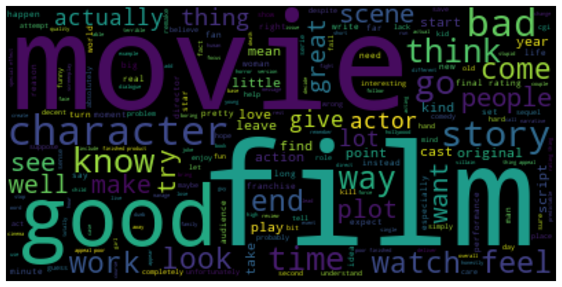
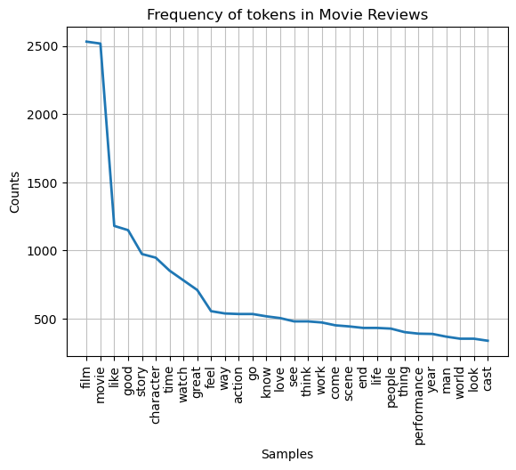
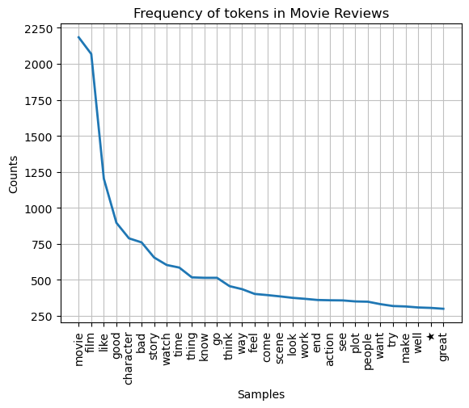
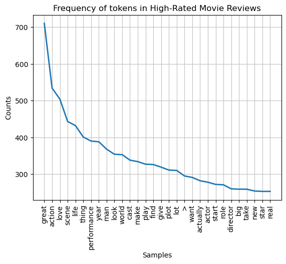

Over the course of this project, you will:

* Part 1: Create your project repository, download IMDB’s movie data, and filter out the subset of movies requested by the stakeholder.
* Part 2: Design a MySQL database for your data and insert the data.
* Part 3: Use an API to extract box office financial data and transform and load it into your database.
* Part 4: Apply hypothesis testing to explore what makes a movie "successful."

